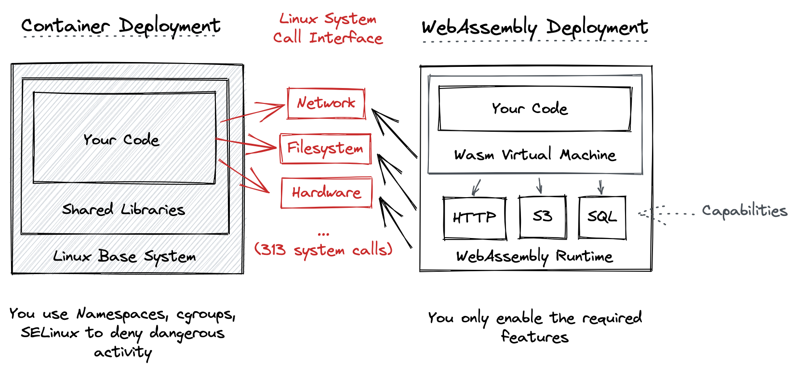

[![Issues][issues-shield]][issues-url]
[![MIT License][license-shield]][license-url]

<br />
<div align="center">
  <h3 align="center">wasm-workflow-executor</h3>

  <p align="center">
    An <a href="https://github.com/argoproj/argo-workflows/blob/master/docs/executor_plugins.md">Executor Plugin</a> for <a href="https://argoproj.github.io/argo-workflows/">Argo Workflows</a> that runs WebAssembly modules! 🚀
    <br />
    <a href="https://github.com/Shark/wasm-workflow-executor/#about-the-project"><strong>Find out why that's awesome »</strong></a>
    <!--
    <br />
    <br />
    <a href="https://github.com/Shark/wasm-workflow-executor/doc/demo.md">View Demo</a>
    ·
    <a href="https://github.com/Shark/wasm-workflow-executor/doc/use-cases.md">All Use Cases</a>
    -->
  </p>
</div>

<!-- TABLE OF CONTENTS -->
<details>
  <summary>Table of Contents</summary>
  <ol>
    <li>
      <a href="#about-the-project">About The Project</a>
      <ul>
        <li><a href="#built-with">Built With</a></li>
      </ul>
    </li>
    <li>
      <a href="#getting-started">Getting Started</a>
      <ul>
        <li><a href="#prerequisites">Prerequisites</a></li>
        <li><a href="#installation">Installation</a></li>
      </ul>
    </li>
    <li><a href="#usage">Usage</a></li>
    <li><a href="#roadmap">Roadmap</a></li>
    <li><a href="#contributing">Contributing</a></li>
    <li><a href="#license">License</a></li>
    <li><a href="#contact">Contact</a></li>
    <li><a href="#acknowledgments">Acknowledgments</a></li>
  </ol>
</details>

## About The Project

This is a tool which allows you use WebAssembly modules instead of containers for your steps in [Argo Workflows](https://argoproj.github.io/argo-workflows/). You might rightfully ask yourself what problem this solves for you.

The two most important aspects are security and performance:

* :lock: **Security**

  The [list of things to do](https://cheatsheetseries.owasp.org/cheatsheets/Docker_Security_Cheat_Sheet.html) when you want to run containers securely is long and the topic is more complex than even ambitious users have the capacity to care about. Containers are [vulnerable in many ways](https://ieeexplore.ieee.org/document/8693491) because of their denylist approach to security: they're allowed to do many things by default.

  WebAssembly's security model is the opposite. As with smartphone apps, they must be given permission for potentially infringing tasks. For example, you might want to give a module the permission to read and write files but not communicate over the internet.

  Container images from third parties you don't know are usually a security nightmare. With WebAssembly, you can run code you don't fully trust with more confidence. Say you have a workflow step that renders Markdown. When the author of your Markdown parser container image decides to deliver a crypto miner instead, most Kubernetes setups will happily run it. If you were using this project and a WebAssembly module: zero chance, since it's easy for you to know that the step doesn't need the network but only takes an input parameter and produces some output. [This example is not made up](https://www.trendmicro.com/vinfo/fr/security/news/virtualization-and-cloud/malicious-docker-hub-container-images-cryptocurrency-mining).

  <details>
    <summary>More about the difference between containers and Wasm modules</summary>
    
    <p>Linux processes use more than 300 system calls for any task that involves sharing data with outside of a process. Containers are a combination of different Linux Kernel technologies (namespaces, cgroups etc.) that segment one computer into many seemlingly independent containers. But this very much depends on a) the secure implementation of all syscalls not to leak anything and b) trust in the application inside the container to do what the user intends it to.</p>
    <p>Wasm modules are very restricted by default. We use application-level capabilities to allow them to access external resources like the network, S3 object stores, or the filesystem. The modules are the capability consumers, the Wasm runtime is the capability provider. The capability provider translates the requests from the Wasm module and acts as a secure proxy to the outside.</p>
  </details>

* :runner: **Performance**

  Containers have some overhead: for each workflow step, Argo creates new Kubernetes Pod. This Pod has several containers to enable all the Argo features, your code is just one of them. All the containers must execute, then results are gathered and sent back to Argo. This all takes time: container images are often towards 100s of megabytes, they may rely on interpreted languages like Python or have huge dependencies leading to a slow start time. You may know the [Cold Start issue](https://aws.amazon.com/blogs/compute/operating-lambda-performance-optimization-part-1/) with Function-as-a-Service. In Argo, every workflow step is a cold start.

  Because WebAssembly modules don't have to bring a whole operating system, they're much smaller. And there is less setup work to do, even for interpreted languages. This means that a module can be run in a matter of milliseconds rather than tens of seconds.

WebAssembly is a new technology in the browser and even more so in the Cloud-Native ecosystem. But there are several ways to ease the transition:

* Containers and Wasm modules play together just fine in the same workflow. Existing container setups don't have to be migrated just because they could. Use Wasm for the tasks for which is a good fit and leave the rest to containers.

* You can find ready-to-use templates for popular programming languages in the [`modules/templates/`](modules/templates/) folder.

* We will provide pre-made modules for popular use cases such as image and text processing, API connectors, etc.

### Built with

Open Source software stands on the shoulders of giants. It wouldn't have been possible to build this tool with very little extra work without the authors of these lovely projects below.

* [Rust](https://rust-lang.org) is used to implement the Argo Executor Plugin API, pull and execute Wasm modules
* [Axum](https://github.com/tokio-rs/axum) is the Rust web framework to handle RPC calls
* [Wasmtime](https://github.com/bytecodealliance/wasmtime) is the WebAssembly Virtual Machine ([WASI](https://wasi.dev) is [supported](https://crates.io/crates/wasmtime-wasi), too)
* [wit-bindgen](https://github.com/bytecodealliance/wit-bindgen) provides the interface between this project as the Wasm host and the Wasm modules
* [oci-distribution](https://crates.io/crates/oci-distribution) allows the tool to pull Wasm modules from OCI registries
* [Best README Template](https://github.com/othneildrew/Best-README-Template)

## Getting Started

### Prerequisites

* This guide assumes you have a working Argo Workflows installation with v3.3.0 or newer.
* You will need to install the [Argo CLI](https://argoproj.github.io/argo-workflows/cli/) with v3.3.0 or newer.
* `kubectl` must be available and configured to access the Kubernetes cluster where Argo Workflows is installed.

### Installation

1. Clone the repository and change to the [`plugin/`](plugin/) directory:

   ```shell
   git clone https://github.com/Shark/wasm-workflow-executor
   cd wasm-workflow-executor/plugin
   ```

1. Build the plugin ConfigMap:

   ```shell
   argo executor-plugin build .
   ```

1. Register the plugin with Argo in your cluster:

   Ensure to specify `--namespace` if you didn't install Argo in the default namespace.

   ```shell
   kubectl apply -f wasm-executor-plugin-configmap.yaml
   ```

## Usage

Now that the plugin is registered in Argo, you can run workflow steps as Wasm modules by simply calling the `wasm` plugin:

```yaml
apiVersion: argoproj.io/v1alpha1
kind: Workflow
metadata:
  generateName: wasm-
spec:
  entrypoint: wasm
  templates:
    - name: wasm
      plugin:
        wasm:
          module:
            oci: 192.168.64.2:32000/demo_mod:latest
```

Input and output parameters between workflow steps work just like you'd expect. Other features like artifacts may still be on the [roadmap](#roadmap) though, which is advised to check for your use case.

## Roadmap

- [ ] **Distributed Mode**

  Right now, all Wasm modules run in the plugin context. This is fine for many use cases because Argo creates a new plugin context for every workflow instance. But the scaling is limited to a single node and this is not the full vision how I intend Cloud-Native Wasm to work.

- [ ] Create ready-to-use modules for demo (cowsay), and then image/text processing
- [ ] Support input + output artifacts
- [ ] Support WASI fallback mode for compatibility with languages without [interface types](https://github.com/WebAssembly/interface-types/blob/main/proposals/interface-types/Explainer.md) library support
- [ ] Create examples for AssemblyScript & (Tiny)Go
- [ ] Enable additional capability providers (HTTP, S3, SQL, etc.)
- [ ] Support authentication for OCI (pull secrets)
- [ ] Support [WAPM](https://wapm.io) as a module source
- [ ] Support [Bindle]() as a module source
- [ ] Implement CLI to invoke modules locally (greatly improves developer experience)


## Contributing

Contributions are what make the open source community such an amazing place to learn, inspire, and create. Any contributions you make are **greatly appreciated**.

If you have a suggestion that would make this better, please fork the repo and create a pull request. You can also simply open an issue with the tag "enhancement".
Don't forget to give the project a star! Thanks again!

1. Fork the Project
2. Create your Feature Branch (`git checkout -b feature/AmazingFeature`)
3. Commit your Changes (`git commit -m 'Add some AmazingFeature'`)
4. Push to the Branch (`git push origin feature/AmazingFeature`)
5. Open a Pull Request

## License

Distributed under the MIT License. See `LICENSE.txt` for more information.

## Contact

Felix Seidel – [@sh4rk](https://twitter.com/sh4rk) – felix@seidel.me

Project Link: [https://github.com/Shark/wasm-workflow-executor](https://github.com/Shark/wasm-workflow-executor)

## Acknowledgements

This is a research project as part of my Master Thesis at the [Chair of Prof. Dr. Holger Karl](https://www.hpi.de/karl/people/holger-karl.html) at [Hasso Plattner Institute](https://www.hpi.de), the University of Potsdam (Germany). Thank you for the ongoing support of my thesis!

[issues-shield]: https://img.shields.io/github/issues/Shark/wasm-workflow-executor.svg?style=for-the-badge
[issues-url]: https://github.com/Shark/wasm-workflow-executor/issues
[license-shield]: https://img.shields.io/github/license/Shark/wasm-workflow-executor.svg?style=for-the-badge
[license-url]: https://github.com/Shark/wasm-workflow-executor/blob/main/LICENSE.txt
